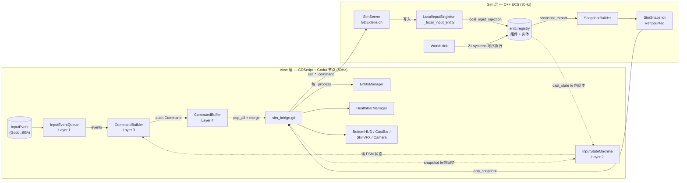
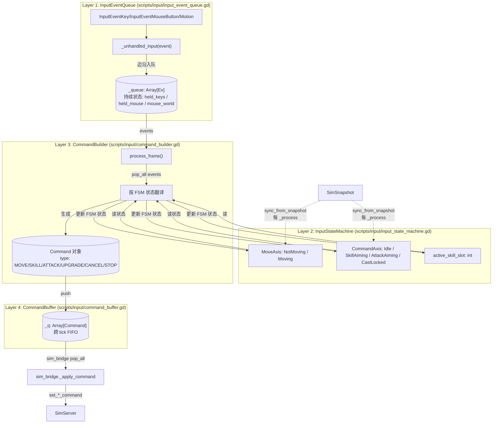
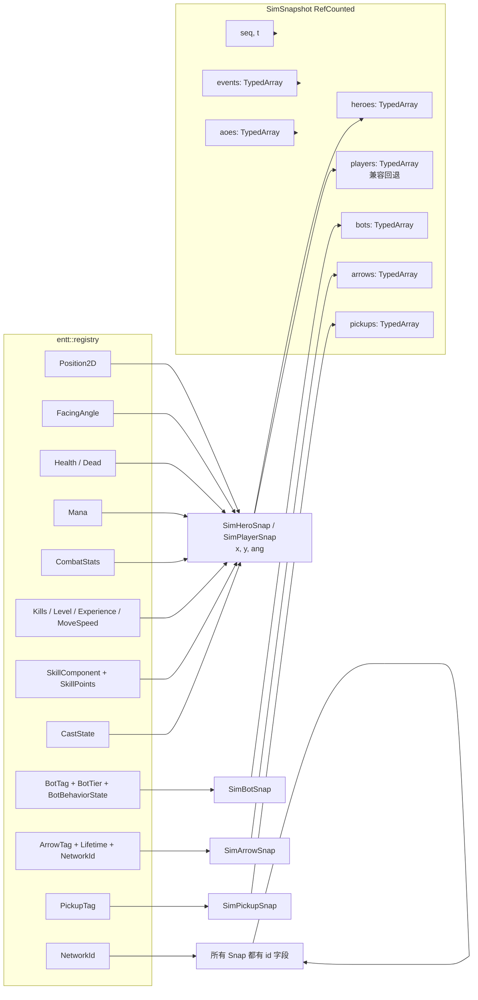
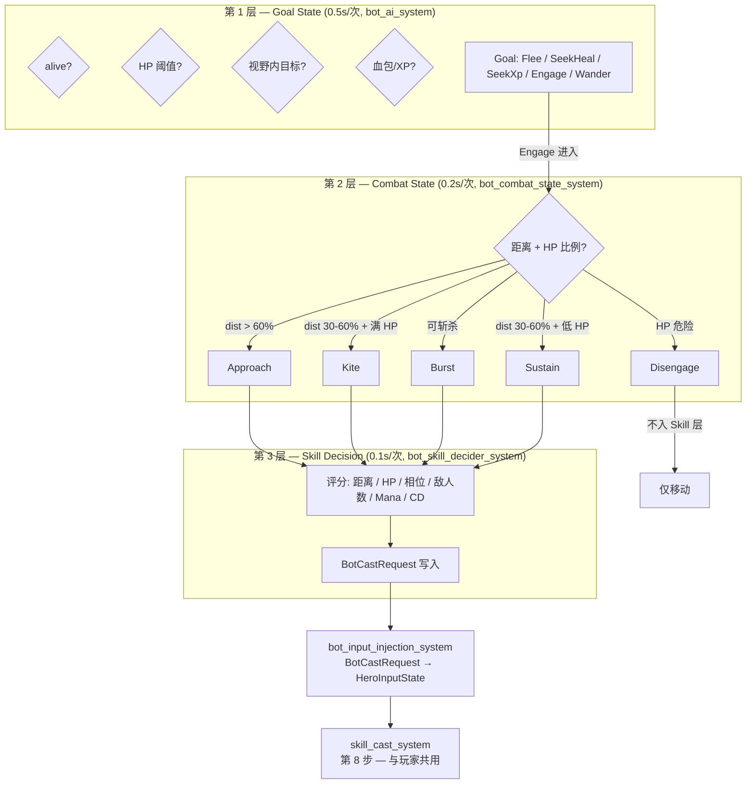
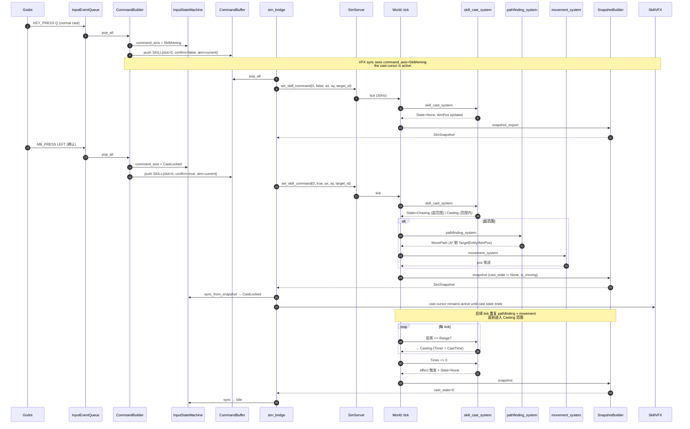
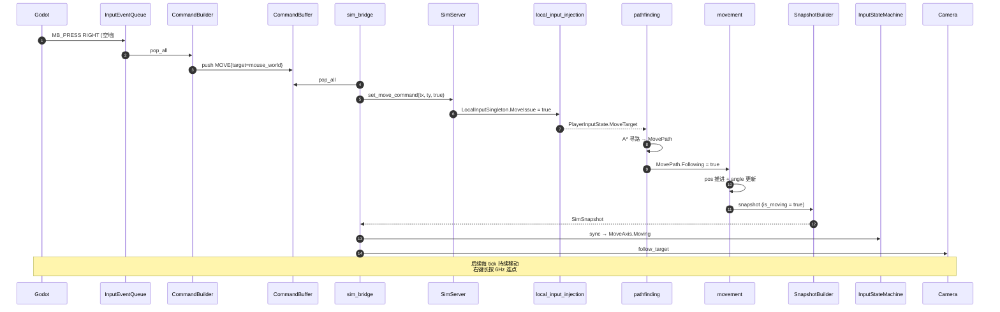
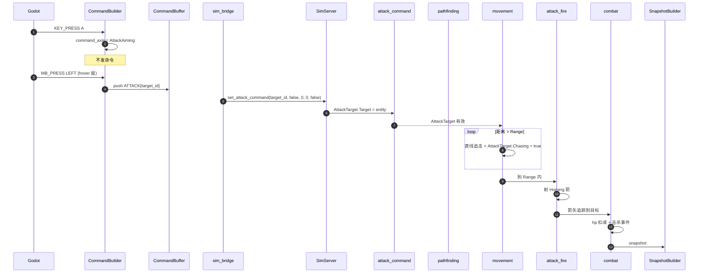
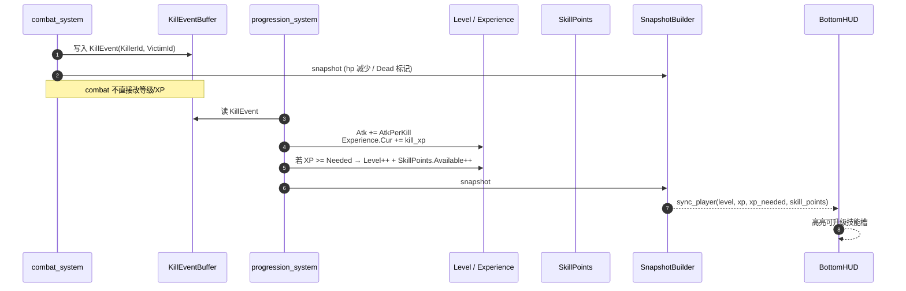

# Data Flow — 从输入到渲染的完整链路

> 最后更新：2026-08-02
> 适用版本：v3 重构后（Hero + Skill 系统重构 + 四层 input + Bot v4 三层状态机）
> 关联文档：
> - `CONTEXT.md` — 项目当前阶段、文件结构、tick 顺序速查
> - `Docs/Reference/sim_api_reference.md` — C++ Sim 组件 / 系统 / API 速查（本表与本文档字段表互补；本文档讲流程，sim_api_reference 讲 API 细节）
> - `Docs/Reference/input_system_design.md` — View 侧四层输入框架详细设计
> - `Docs/Reference/hero_skill_architecture.md` — Hero / Skill 重构记录
> - `Docs/Reference/bot_ai.md` — Bot v4 三层状态机
> ⚠️ 本文档可能不是最新；如与代码冲突，**以代码为准**，再用此文档导航。

---

## 0. 速读：一帧数据的完整旅程

```
[60Hz Godot _process / _unhandled_input]
      ↓ 原始 InputEvent
[InputEventQueue]   — Layer 1：边沿事件入队 + 持续状态采样
      ↓ pop_all (per render frame)
[CommandBuilder]    — Layer 3：FSM 状态 + 事件 → 语义命令（不经过 Layer 2 的命令/状态分离，但读 FSM 状态）
[InputStateMachine] — Layer 2：双轴 FSM（MoveAxis × CommandAxis）— 跨帧状态，View 镜像 Sim 状态
      ↓ buffer.push
[CommandBuffer]     — Layer 4：跨 tick FIFO 队列
      ↓ pop_all + merge (per sim tick)
[sim_bridge.gd]     — 把 Command 翻译成 set_*_command → SimServer（GDExtension）
      ↓
[SimServer]         — GDExtension 绑定，把参数写入 World._local_input_entity.LocalInputSingleton
      ↓
[World::tick]       — 30Hz：21 个 inline System 按固定顺序执行（见 §4）
      ↓ 末尾
[SnapshotBuilder]   — 遍历 registry，生成 RefCounted SimSnapshot
      ↓ pop_snapshot
[sim_bridge.gd._process]  — 60Hz：从 snapshot 读最新状态 → 推 View 节点
      ↓
[EntityManager / HealthBarManager / BottomHUD / SkillVFX / CastBar / Camera]  — 渲染层
```

**关键约束**：
- Sim 与 View **完全解耦**，唯一通道是 `SimSnapshot`（RefCounted）。
- Sim 不调用 View 代码，View 不调用 Sim 系统内部（仅通过 `SimServer` 提供的命令入口）。
- 所有 System 是 `inline void` 自由函数，通过 **组件** 通信（不通过全局变量、不跨函数调用）。
- 实体创建/销毁通过 `CommandBuffer` 延迟到 tick 末尾 `flush()`，防迭代器失效。

---

## 1. 顶层架构图



---

## 2. View → Sim：输入链路（四层）

详见 `Docs/Reference/input_system_design.md`。本节给出数据流视角。



### 2.1 Layer 1 — 原始事件采集

**文件**：`scripts/input/input_event_queue.gd`
**入口**：`_unhandled_input(event)`（Godot 引擎回调）

数据流：

1. `InputEventMouseMotion` → 摄像机 ray 投影到 y=0 平面 → 写 `mouse_world`（`Vector2`）并入 `MOUSE_MOVE` 事件。
2. `InputEventKey` (`pressed=true, echo=false`) → `push_key_press(keycode)`：写 `held_keys[key]=true`、自增 `_seq`、入 `KEY_PRESS` 事件。
3. `InputEventKey` (`pressed=false`) → `push_key_release`：清 `held_keys[key]`、入 `KEY_RELEASE`。
4. `InputEventMouseButton` → 同上更新 `mouse_world` + `held_mouse[button]=true` + 入 `MB_PRESS/MB_RELEASE`。
5. `pop_all()`：`duplicate() + clear()`，整批取出（Layer 3 下一帧消费）。

事件结构体 `Ev`：

```gdscript
class Ev:
    var type: int      # EType 枚举
    var key: int       # KEY_* 或 MOUSE_BUTTON_*
    var pos: Vector2   # 鼠标世界坐标（按下时已投影）
    var t: float       # Time.get_ticks_msec() / 1000.0
    var seq: int       # 自增序号
```

### 2.2 Layer 2 — Input State Machine

**文件**：`scripts/input/input_state_machine.gd`

状态字段（跨帧持久）：

- `move_axis: MoveAxis` — `{NotMoving, Moving}`，由 snapshot `is_moving` 字段同步。
- `command_axis: CommandAxis` — `{Idle, SkillAiming, AttackAiming, CastLocked}`，由 snapshot `cast_state` 反向同步。
- `active_skill_slot: int` — 当前 normal cast 瞄准的技能槽（0-3）。

**关键**：Layer 2 不直接接收事件，由 Layer 3 在 `process_frame()` 读 + 写。

**反向同步（snapshot → FSM）**（`sim_bridge.gd._process` 调用 `sync_from_snapshot`）：

```text
if hero.cast_state != 0  →  command_axis = CastLocked
else if command_axis == CastLocked  →  command_axis = Idle
                                                  （SkillAiming 保留，仅 cancel/手动解除）
if hero.is_moving  →  move_axis = Moving
else  →  move_axis = NotMoving
```

**例外**：`SkillAiming` 不由 snapshot 决定（Sim 侧 normal cast Aiming 期间 `cast_state==None`），仅由 cancel 事件（右键/S/ESC/H）解除。

### 2.3 Layer 3 — Command Builder

**文件**：`scripts/input/command_builder.gd`
**入口**：每个渲染帧 `sim_bridge._physics_process` 第一个 sim tick 之前调 `command_builder.process_frame()`。

```gdscript
func process_frame() -> void:
    var events = queue.pop_all()
    if events.is_empty():
        _send_skill_aim_update()  # 维持 normal cast aim 跟随
        _process_held_move()      # 右键长按连点节流（6Hz）
        return
    for ev in events:
        _process_event(ev)        # 翻译为 Command
    _process_held_move()
```

**翻译规则摘要**（详见 `Docs/Reference/input_system_design.md` §5.2）：

| FSM 状态 | 事件 | 生成 Command |
| --- | --- | --- |
| Idle | 右键空地 | `MOVE{target=mouse_world}` |
| Moving | 右键空地 / 长按节流 | `MOVE`（覆盖） |
| Idle/Moving | S press | `STOP` |
| Idle/Moving | A press | （不发命令，仅切 `AttackAiming`） |
| AttackAiming | 左键+hover 敌 | `ATTACK{target_id}` |
| AttackAiming | 左键+空地 | `ATTACK{ground=pos}` |
| Idle/Moving | 技能键（quick） | `SKILL{slot, confirm=true, aim}` |
| Idle/Moving | 技能键（normal） | `SKILL{slot, confirm=false, aim}` + 切 `SkillAiming` |
| SkillAiming | 左键 | `SKILL{slot, confirm=true, aim}` + 切 `Idle` |
| SkillAiming | 右键/S/ESC/H | `CANCEL{scope=skill}` + 切 `Idle` |
| CastLocked | 右键/S/H | `CANCEL{scope=skill}`（Sim 自判可打断） |
| 任意（非 CastLocked） | Ctrl+技能键 | `SKILL_UPGRADE{slot}` |
| Idle/Moving | 右键+hover 敌 | `ATTACK{target_id}`（直接连敌，不进 AttackAiming） |

`Command` 数据类（`scripts/input/command.gd`）：

```gdscript
enum CmdType { MOVE, SKILL, SKILL_UPGRADE, ATTACK, CANCEL, STOP }
# MOVE:        move_target: Vector2
# SKILL:       skill_slot, skill_confirm, skill_aim, skill_target_id
# SKILL_UPGRADE: skill_slot
# ATTACK:      attack_target_id, attack_ground: Vector2
# CANCEL:      cancel_scope (0=skill, 1=attack, 2=all)
# STOP:        (no payload)
```

### 2.4 Layer 4 — Command Buffer

**文件**：`scripts/input/command_buffer.gd`

`CommandBuilder` 每帧 push 0~N 条 → `_q: Array[Command]`。
`sim_bridge` 每个 sim tick 调 `pop_all()` 取全部 → `merge_commands()` 去重 → 调 `set_*_command`。

**合并规则**（防 1 tick 内同帧冗余）：

| 类型 | 合并 |
| --- | --- |
| MOVE | 仅保留最后一条 |
| SKILL | 同 slot 后续覆盖；`confirm=true` 覆盖 `confirm=false` |
| SKILL_UPGRADE | 仅保留最后一条 |
| ATTACK | 仅保留最后一条 |
| CANCEL | `scope` 累加（0/1/2） |
| STOP | 保留 |

### 2.5 sim_bridge — Command → SimServer 翻译

**文件**：`scripts/sim_bridge.gd` `_physics_process` 块

```gdscript
while elapsed >= TICK_RATE:
    if first_tick:
        command_builder.process_frame()
    var cmds := command_buffer.pop_all()
    var merged := command_buffer.merge_commands(cmds)
    for c in merged:
        _apply_command(c)  # 写 _tmp_* 适配字段

    sim.set_skill_command(slot, confirm, aim_x, aim_y, target_id)
    sim.set_skill_upgrade_command(slot)
    sim.set_attack_command_full(target_id, ground, gx, gy, clear)
    sim.set_cancel_command(skill, attack)
    sim.set_move_command(tx, ty, issue and first_tick)
    sim.set_stop_command(stop and first_tick)
    sim.tick(TICK_RATE)
    elapsed -= TICK_RATE

    # 清脉冲字段
    ...
    var snap = sim.pop_snapshot()
    if snap is SimSnapshot:
        last_snapshot = snap
```

`_apply_command` 维护 13 个临时字段（`_tmp_move_target` / `_tmp_cast_slot` / …），`sim.*_command` 调用把这些值传给 C++ 端。

**`first_tick` 优化**：每渲染帧（60Hz）最多运行 2 个 sim tick（30Hz）。`first_tick` 标志保证 `MOVE` / `STOP` 等"一次事件"脉冲只在第一个 tick 触发，避免重复 issue。

---

## 3. Sim 端：World::tick 顺序

**文件**：`src_cpp/sim/world.cpp` `World::tick`

```mermaid
flowchart TB
    Start([World::tick dt]) --> LII[1. local_input_injection_system<br/>Singleton → PlayerInputState]
    LII --> BT[2. bot_targeting_system<br/>视野扫描 + 目标锁定]
    BT --> BA[3. bot_ai_system<br/>Goal 状态机 0.5s/次]
    BA --> BCS[4. bot_combat_state_system<br/>Combat State 0.2s/次<br/>Approach/Kite/Burst/Sustain/Disengage]
    BCS --> BSD[5. bot_skill_decider_system<br/>评分选择技能 0.1s/次]
    BSD --> BII[6. bot_input_injection_system<br/>Bot AI → HeroInputState]

    BII --> AC[7. attack_command_system<br/>ATTACK 命令 → AttackTarget]
    AC --> SC[8. skill_cast_system<br/>CastState 状态机<br/>None/Aiming/Chasing/Casting/Channeling/Dashing]
    SC --> PF[9. pathfinding_system<br/>A* 寻路 → MovePath]
    PF --> MV[10. movement_system<br/>MovePath 跟随 + AttackTarget 追击 + Dashing]
    MV --> AF[11. attack_fire_system<br/>到 Range → 射 homing 箭]

    AF --> AM[12. arrow_movement_system<br/>位置推进 + Homing 追踪]
    AM --> WC[13. wall_collision_system<br/>AABB 推出 + 箭矢销毁]
    WC --> CB[14. combat_system<br/>箭矢碰撞 + 扣血 + 击杀事件]

    CB --> GO{玩家死亡?}
    GO -->|是| END([game_over=true])
    GO -->|否| PK[15. pickup_system<br/>生成器 + 拾取碰撞]
    PK --> AO[16. aoe_system<br/>AoE 实体生命周期]
    AO --> SE[17. status_effect_system<br/>Root/Stun timer 递减]
    SE --> MR[18. mana_regen_system<br/>Mana.Cur 回复]
    MR --> SCO[19. skill_cooldown_system<br/>CooldownTimer 递减]
    SCO --> SL[20. skill_level_system<br/>消费 SKILL_UPGRADE → Level++]
    SL --> PR[21. progression_system<br/>KillEventBuffer → XP/Level/ATK]
    PR --> SE2[22. snapshot_export_system<br/>构建 SimSnapshot]
    SE2 --> FL[_cb.flush registry<br/>延迟实体创建/销毁]
    FL --> EndLoop([next tick])
```



**关键时序约束**：

- `skill_cast` (#8) 必须在 `pathfinding` (#9) + `movement` (#10) **之前**：confirm 同 tick 进 Chasing → #9 立刻 A* → #10 立刻跟随，**无 1 tick 延迟**。
- `attack_command` (#7) 在 `skill_cast` (#8) 之前：先处理 ATTACK 设 AttackTarget，再决定施法。
- `wall_collision` (#13) 在 `movement` (#10) 之后：读 `AttackTarget.Chasing` 标志跳过穿墙追击，读 `CastState::Dashing` 跳过 dash 位移。
- `combat` (#14) 在 `arrow_movement` (#12) 之后：Homing 箭已追踪到目标附近。
- `_cb.flush()` 在所有 system 之后才执行，期间新建/销毁实体操作均在队列中。

---

## 4. 组件 → Snapshot 字段映射

**生成**：`src_cpp/sim/snapshot_builder.cpp`
**类型**：`src_cpp/sim/snapshot_types/`（7 个 GDCLASS 子目录）
**绑定**：`src_cpp/sim/snapshot_bindings.cpp`（BIND + PROP 宏）



**SimHeroSnap 关键字段**（`is_local=true` 标志由 snapshot 内部 index 暴露）：

| 字段 | 来源 | 用途 |
| --- | --- | --- |
| `id, x, y, ang` | NetworkId / Position2D / FacingAngle | 位置朝向 |
| `hp, max_hp, dead` | Health / Dead | 血量 |
| `mana, max_mana` | Mana | 法力 |
| `atk, asp, speed` | CombatStats / MoveSpeed | 属性 |
| `kills, level, xp, xp_needed` | Kills / Level / Experience | 成长 |
| `skills[]` | SkillComponent.Slots | 4 槽（skill_id, level, cooldown, max_cooldown, mana_cost） |
| `cast_state, cast_slot, cast_progress` | CastState | 施法阶段 / 槽 / 进度 |
| `cast_aim_x/y, dash_sx/sy, dash_tx/ty` | CastState.AimPos / Dash | VFX |
| `hit_target_id` | CastState.HitTargetId | C 命中 VFX |
| `cast_error` | CastState.CastError | 错误码（1=CD 2=Mana 3=Stun 4=No target 5=Target dead） |
| `attack_target_id` | AttackTarget.TargetNetworkId | 红色锁定指示器 |
| `cast_target_id` | CastState.TargetNetworkId | View 高亮跟随目标 |
| `is_moving` | `path.Following \|\| at.Chasing \|\| cs.State==Chasing` | View MoveAxis 同步 |
| `skill_points` | SkillPoints.Available | HUD 升级提示 |
| `tier, is_local, hero_def_id` | BotTier / PlayerTag / HeroDefId | 单位元信息 |

详见 `Docs/Reference/sim_api_reference.md` §5 完整字段表与所有 8 个 GDCLASS 类型的说明。

---

## 5. Sim → View：Snapshot 消费

**文件**：`scripts/sim_bridge.gd._process`（60Hz）
**快照源**：`last_snapshot: SimSnapshot`（`_physics_process` 末尾 `pop_snapshot` 写入）

```mermaid
flowchart TB
    SNAP[last_snapshot] --> SEQ{seq 变化?}
    SEQ -->|是| EM1[EntityManager.sync_entities<br/>3D 节点位置/朝向插值]
    SEQ -->|是| HM1[HealthBarManager.sync_bars<br/>血条位置/数值/可见性]
    SEQ -->|是| LHE{hero local_idx?}
    LHE -->|有| HL1[取 last_snapshot.heroes[local_idx]]
    LHE -->|无| LP1[取 last_snapshot.players[0]]
    HL1 --> SAT[set_attack_target_id]
    LP1 --> SAT
    HL1 --> CSS[cast_state 转移 + hit_target_id VFX]
    LP1 --> CSS
    HL1 --> ISM1[InputStateMachine.sync_from_snapshot]
    LP1 --> ISM1

    SNAP -->|每帧| FB{本地单位?}
    FB -->|heroes[local_idx]| CAM1[CameraController.follow_target]
    FB -->|players[0]| CAM1
    FB -->|heroes[local_idx]| HUD1[BottomHUD.sync_player/sync_skills]
    FB -->|players[0]| HUD1
    FB -->|heroes[local_idx]| CAST[CastBarLayer.sync_cast]
    FB -->|players[0]| CAST
    FB -->|heroes[local_idx]| VFX1[SkillVFX.sync]
    FB -->|players[0]| VFX1
```

**关键节点**：

| 节点 | 文件 | 职责 |
| --- | --- | --- |
| `EntityManager` | `scripts/view/entity_manager.gd` | 3D 实体增删 + 位置/朝向 LERP 插值（30→60Hz 平滑）+ hover_id |
| `HealthBarManager` | `scripts/ui/health_bar_manager.gd` | 血条池 + 跟随实体 + hp/mana 数值 |
| `BottomHUD` | `scripts/ui/bottom_hud.gd` | 等级/XP/技能槽/物品栏/技能点提示 |
| `CastBarLayer` | `scenes/ui/cast_bar.tscn` | `cast_state >= Casting(3)` 时显示进度条 |
| `CastErrorLayer` | `scenes/ui/cast_error_layer.tscn` | `cast_error` 变化时弹红字 |
| `SkillVFX` | `scripts/view/skill_vfx.gd` | dash path and AoE circles |
| `CameraController` | `scripts/view/camera_controller.gd` | 跟随 + 锁/自由 + 像素精准拖屏 + 边缘推屏 |

**反向同步（snapshot → FSM）**（`sim_bridge._process`）：

```gdscript
if local_idx >= 0 and last_snapshot.heroes.size() > 0:
    input_state_machine.sync_from_snapshot(last_snapshot.heroes[local_idx])
elif last_snapshot.players.size() > 0:
    input_state_machine.sync_from_snapshot(last_snapshot.players[0])
```

`InputStateMachine.sync_from_snapshot(snap_hero)`（伪代码）：

```gdscript
move_axis = MoveAxis.Moving if snap_hero.is_moving else MoveAxis.NotMoving
if snap_hero.cast_state != 0:
    command_axis = CommandAxis.CastLocked
else:
    if command_axis == CommandAxis.CastLocked:
        command_axis = CommandAxis.Idle
    # SkillAiming 不解除（normal cast Aiming 期间 Sim 仍 None）
```

---

## 6. Bot AI：v4 三层状态机

**关联**：`Docs/Reference/bot_ai.md`
**入口**：`bot_input_injection_system` — Bot AI 状态写入 `HeroInputState`（与玩家同链路）



**关键**：Bot 完全通过 `HeroInputState` 走与玩家相同的战斗链路（不调用 player_* 系统），由 `bot_input_injection` 注入。

---

## 7. 关键数据通路（端到端样例）

### 7.1 玩家按 Q 技能（normal cast，瞄准后确认）



### 7.2 右键点空地移动



### 7.3 普攻命令（A 键 + 左键点敌）



### 7.4 击杀 → 经验 → 升级



---

## 8. 关键文件索引

| 数据 | 入口 | 出口 |
| --- | --- | --- |
| **输入** | `scripts/input/input_event_queue.gd` `_unhandled_input` | → `CommandBuffer._q` |
| **命令** | `scripts/input/command_builder.gd` `process_frame` | → `CommandBuffer._q` |
| **快照** | `sim.pop_snapshot()` 返回 `Ref<SimSnapshot>` | `scripts/sim_bridge.gd` `last_snapshot` |
| **渲染** | `scripts/sim_bridge.gd` `_process` 读 `last_snapshot` | `EntityManager` / `HealthBarManager` / `BottomHUD` / `SkillVFX` / `Camera` |
| **入口命令** | `SimServer.set_*_command` 6 个方法 | `World._local_input_entity.LocalInputSingleton` |
| **Tick 循环** | `World::tick(dt)` (30Hz) | 21 system + `_cb.flush` + `SnapshotBuilder::build` |
| **Hero + Skill** | `src_cpp/sim/heroes/hero_registry.cpp` + `src_cpp/sim/skills/skill_registry.cpp` | `HeroInputState` + `SkillComponent.Slots[i]` |
| **Bot AI** | `bot_targeting_system` → `bot_ai_system` → `bot_combat_state_system` → `bot_skill_decider_system` → `bot_input_injection_system` | `HeroInputState`（与玩家共用链路） |

---

## 9. 反模式与陷阱

| 反模式 | 后果 | 正确做法 |
| --- | --- | --- |
| View 直接调 `World.registry()` 修改组件 | 破坏 Sim 权威，30/60Hz desync | 只走 `set_*_command` + `pop_snapshot` |
| System 内直接 `_reg.create()` / `destroy()` | 迭代器失效 | 通过 `CommandBuffer` 延迟到 `flush()` |
| System 间函数调用通信 | 耦合难维护 | 仅通过组件读写 |
| View 每帧遍历全部 entity 重新创建节点 | 性能灾难 | `EntityManager.sync_entities` 池化 + 插值 |
| Input 边沿事件不立即推 Sim | 30Hz vs 60Hz 丢指令 | `InputEventQueue` 队列 + `CommandBuffer` 跨 tick |
| 改 `_local_input_entity` 字段时跳 `local_input_injection_system` | PlayerInputState 不更新，下游 system 看不到 | 必须走 World API |
| Sim 内引用 Godot 类型（`RefCounted` / `Vector2`） | 编译失败 / 运行时崩溃 | Sim 零 Godot 依赖；用 `Vec2 = glm::vec2` |
| Bot AI 写 `Position2D` 直接移动 | 绕过 pathfinding / wall_collision | 走 `bot_input_injection` → `HeroInputState` → `pathfinding` + `movement` |
| `CommandBuilder` 直接改 `SimHeroSnap` | 破坏 Sim 权威 | 写 `Command` → `CommandBuffer` → `set_*_command` |
| 新增 snapshot 字段忘记 `_bind_methods` | GDScript 读不到 | 改 `snapshot_types.h` + `snapshot_bindings.cpp` + `snapshot_builder.cpp` 三处 |

---

## 10. 总结：三层通信

| 通信方向 | 通道 | 频率 | 数据形态 |
| --- | --- | --- | --- |
| **View → Sim** | `SimServer.set_*_command` 6 个方法 | 每 sim tick (30Hz) | 6 类标量参数（move/aim、slot、target_id、bool 标志） |
| **Sim → View** | `SimSnapshot` (RefCounted, 7 TypedArray) | 每 sim tick (30Hz) | 完整 gameplay 状态（位置/血量/施法/VFX/事件） |
| **Sim 内部** | `entt::registry` 组件读写 | 每 sim tick (30Hz) | 21+ 组件 struct，**无全局变量** |
| **View 内部** | 节点引用 + signal | 每渲染帧 (60Hz) | Godot 节点 API |

**权威性原则**：
- **Sim 权威**所有 gameplay 状态（HP/位置/施法阶段/移动路径）。
- **View 镜像**只用于决定下一个事件如何翻译（FSM 的视图侧），**不可**作为 gameplay 真值。
- 任何"View 想做但 Sim 不允许"的操作 → 必须通过 `set_*_command` 通知 Sim，由 Sim 在 `tick` 内推进。

## Current Bootstrap Ownership (2026-08-04)

The current implementation uses `WorldBootstrap` for static root-world visuals and `UIRoot` for persistent code-built UI. UI scenes under `scenes/ui/` are no longer runtime dependencies. `HealthBarManager` prewarms its code-built health-bar pool from `SimServer.get_hero_capacity()` before the first simulation tick. See `Docs/Reference/game_main_process_execution_order.md` for the authoritative startup and frame-order contract.
